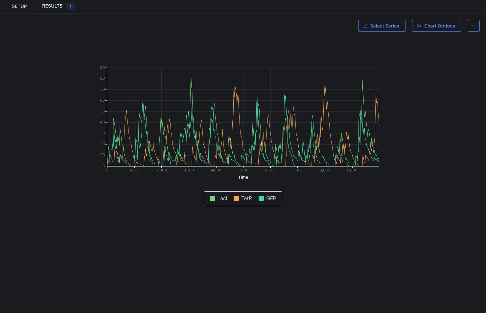

### Repressilator

The repressilator consists of three promoters each with a repressor gene. It is a cyclic negative-feedback loop, periodically inducing the synthesis of green fluorescent proteins [1].

When opening [SynBioSuite](https://synbiosuite.org/) in Google Chrome click the blue __Open Folder__ button located in the top left corner. Select this folder, _Example 1_, and allow the site to edit its files. You will then see the Repressilator under the SBOL Component menu and the Analysis under the Analysis menu. After double-clicking on the SBOL file, SBOLCanvas will open and the following will be displayed:   

When opening the Analysis with a double click you can click the __Run Analysis__ button to start the simulation. After the simulation is finished you will see a blue 1 next to the _RESULTS_ tab in the top left corner. After selecting the _RESULTS_ tab, select _LacI_, _TetR_, and _GFP_ to be displayed to see the oscillating behavior:

You can also run your own analysis by clicking the __+ New Analysis__ button and following the steps shown. The given example does not have associated sequences. However, they are not needed to use SynBioSuite's simulation and analysis capabilities

1. Elowitz, M. B.; Leibler, S. A Synthetic Oscillatory Network of Transcriptional Regulators. Nature 2000, 403 (6767), 335–338. https://doi.org/10.1038/35002125.
