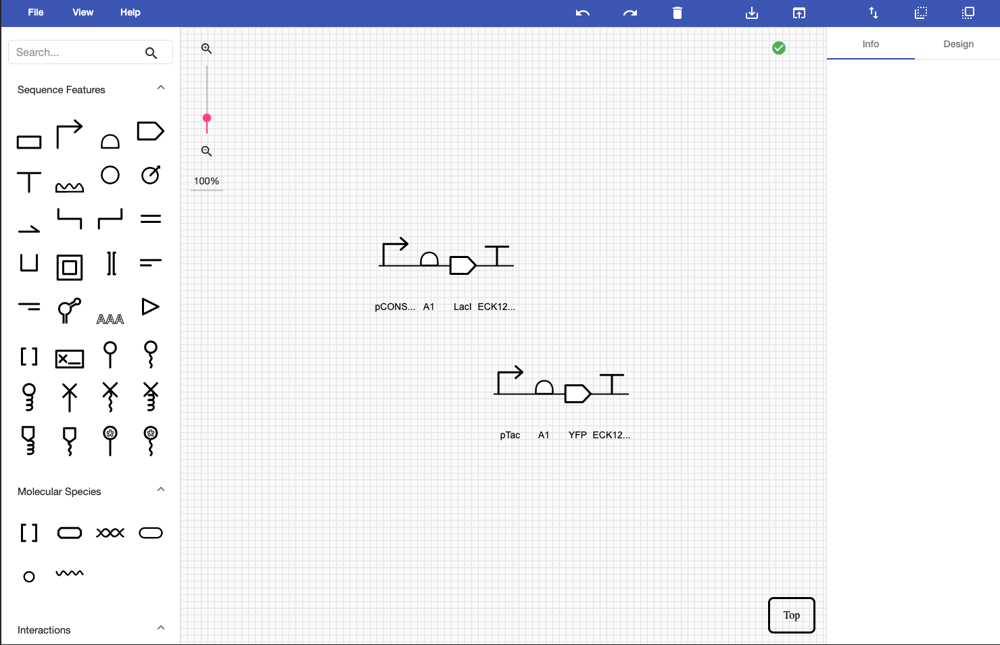

### Inverter

This example is a simpler inverter that produces _YFP_ in the absence of _LacI_ protein. This example provides the inverter as a SBOL file, as well as an environment including the simulation parameters given as an OMEX archive.

When opening [SynBioSuite](https://synbiosuite.org/) in Google Chrome click the blue __Open Folder__ button located in the top left corner. Select this folder, _Example 3_, and allow the site to edit its files. You will then see the Inverter under the SBOL Component menu, the InverterEnvironment under OMEX Archives, and the Analysis under the Analysis menu. The OMEX file can not be opened, since it is a compressed file containing a simulation environment, which is a model. After double-clicking on the SBOL file, SBOLCanvas will open and the following will be displayed:   

When opening the Analysis with a double click you can click the __Run Analysis__ button to start the simulation. After the simulation is finished you will see a blue 1 next to the _RESULTS_ tab in the top left corner. After selecting the _RESULTS_ tab, select _C1__LacI_protein_ and _YFP_ to see the behavior of the inverter:

